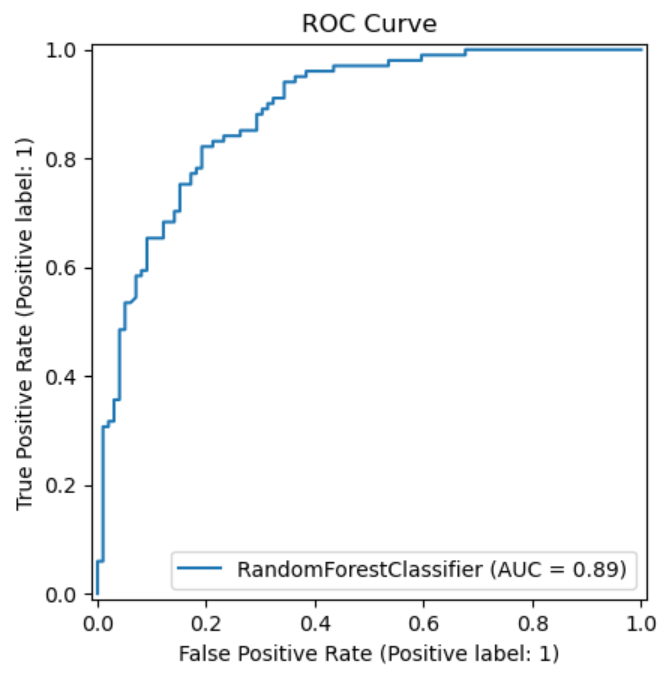

# Laporan Proyek Machine Learning - Muhammad Ikram Sabila Rasyad

## 📁 **Domain Proyek**

### **Latar Belakang**

Diabetes Mellitus tipe 2 adalah penyakit kronis yang ditandai oleh kadar gula darah tinggi akibat gangguan produksi atau penggunaan insulin. Menurut WHO, diabetes menyebabkan 1,5 juta kematian per tahun di seluruh dunia dan jumlahnya terus meningkat, terutama di negara berkembang \[1]. Deteksi dini terhadap diabetes sangat penting untuk mencegah komplikasi serius seperti penyakit jantung, gagal ginjal, dan kebutaan.

Sayangnya, banyak penderita diabetes tidak menyadari kondisi mereka karena gejalanya yang bersifat “diam-diam.” Oleh karena itu, sistem skrining otomatis berbasis data medis dapat membantu tenaga medis mengidentifikasi risiko diabetes secara lebih cepat dan efisien.

Dataset **Pima Indians Diabetes** dari UCI Machine Learning Repository mencatatkan berbagai indikator medis dari perempuan keturunan Pima Indian yang digunakan untuk memprediksi apakah mereka menderita diabetes atau tidak.

---

### **Urgensi Permasalahan**

* **Mengapa harus diselesaikan?** Karena diabetes sering tidak terdiagnosis hingga stadium lanjut. Deteksi dini dapat mengurangi beban biaya dan meningkatkan kualitas hidup pasien.
* **Bagaimana menyelesaikannya?** Dengan membangun sistem machine learning yang mampu memprediksi risiko diabetes dari fitur-fitur seperti BMI, usia, kadar glukosa, tekanan darah, dll.

---

### **Referensi**

\[1] World Health Organization. (2023). *Diabetes*. \[Online] Available: [https://www.who.int/news-room/fact-sheets/detail/diabetes](https://www.who.int/news-room/fact-sheets/detail/diabetes)
\[2] Smith, B. et al. (2020). “Machine Learning for Early Detection of Diabetes,” *Journal of Biomedical Informatics*, vol. 102, pp. 103-110.
\[3] National Institute of Diabetes and Digestive and Kidney Diseases (NIDDK). (2022). *Diabetes Statistics*.

---

## 💼 **Business Understanding**

### **Problem Statements**

1. **Bagaimana cara memprediksi apakah seseorang menderita diabetes berdasarkan data medis?**
2. **Model machine learning apa yang paling efektif digunakan untuk prediksi diabetes pada dataset Pima Indians?**
3. **Bagaimana kita dapat meningkatkan performa model baseline agar hasilnya dapat diandalkan untuk tujuan skrining medis?**

---

### **Goals**

1. **Membangun sistem prediksi diabetes menggunakan supervised machine learning** yang memanfaatkan fitur medis seperti BMI, Glucose, dan Age.
2. **Mengevaluasi dan membandingkan performa beberapa algoritma klasifikasi** seperti Logistic Regression, Random Forest, SVM, dan KNN.
3. **Melakukan hyperparameter tuning untuk meningkatkan akurasi dan sensitivitas** model terbaik, agar risiko false negative dapat ditekan.

---

### **Solution Statements**

Untuk mencapai goals di atas, dilakukan pendekatan sebagai berikut:

#### ✅ **Solution Statement 1: Multi-Model Comparison**

Menguji beberapa model klasifikasi (Logistic Regression, KNN, SVM, Random Forest) pada dataset yang telah dibersihkan dan dinormalisasi.
→ Tujuan: menemukan model dengan kombinasi **precision, recall, dan ROC-AUC** terbaik.

#### ✅ **Solution Statement 2: Model Improvement dengan Hyperparameter Tuning**

Melakukan tuning pada model terbaik (Random Forest) menggunakan **GridSearchCV** untuk meningkatkan kinerja.
→ Tujuan: menurunkan false negative dan meningkatkan **F1-score** serta **ROC AUC**.

#### ✅ **Metrik Evaluasi yang Digunakan**

Model diukur dengan metrik:

* **Recall (Sensitivity)** → prioritas utama agar penderita tidak terlewat.
* **Precision** → menjaga efisiensi tes lanjutan.
* **F1-Score** → keseimbangan.
* **ROC-AUC** → evaluasi global kemampuan model membedakan kelas.
Berikut versi **sederhana** dari bagian **Data Understanding**, tanpa menyertakan kode:

---

## 📊 **Data Understanding**

### **1. Informasi Dataset**

Dataset yang digunakan dalam proyek ini adalah **Pima Indians Diabetes Dataset** dari UCI Machine Learning Repository, yang juga tersedia di Kaggle. Dataset ini terdiri dari **768 baris** (sampel) dan **9 kolom** (fitur). Dataset ini berisi informasi medis dari perempuan keturunan suku Pima Indian di Amerika Serikat, dengan usia minimal 21 tahun. Tujuan penggunaan data ini adalah untuk memprediksi apakah seseorang menderita diabetes berdasarkan berbagai indikator kesehatan.

📎 Sumber data: [https://www.kaggle.com/datasets/uciml/pima-indians-diabetes-database](https://www.kaggle.com/datasets/uciml/pima-indians-diabetes-database)

---

### **2. Deskripsi Variabel**

Berikut adalah variabel-variabel yang terdapat pada dataset:

* **Pregnancies**: Jumlah kehamilan yang pernah dialami pasien.
* **Glucose**: Kadar glukosa dalam darah setelah tes toleransi glukosa oral.
* **BloodPressure**: Tekanan darah diastolik (dalam mm Hg).
* **SkinThickness**: Ketebalan lipatan kulit trisep (dalam mm).
* **Insulin**: Kadar insulin dalam darah 2 jam setelah makan.
* **BMI**: Indeks massa tubuh, sebagai indikator obesitas.
* **DiabetesPedigreeFunction**: Skor risiko diabetes berdasarkan riwayat keluarga.
* **Age**: Usia pasien (dalam tahun).
* **Outcome**: Label target, 1 menunjukkan pasien menderita diabetes, dan 0 menunjukkan tidak.

---

### **3. Kualitas Data**
Berdasarkan pemeriksaan awal terhadap dataset, tidak ditemukan missing value maupun nilai nol pada seluruh kolom numerik. Oleh karena itu, tidak diperlukan proses imputasi atau penanganan khusus terkait kualitas data pada tahap awal. Adapun data masih banyak yang berada di luar jangkauan atau merupakan nilai Outlier, dengan demikian data akan dilakukan Winsorizing di tahap Data Preperation.

---

### **4. Exploratory Data Analysis (EDA)**

Untuk memahami karakteristik data, dilakukan analisis awal berupa visualisasi distribusi masing-masing fitur berdasarkan status diabetes (Outcome). Hasilnya menunjukkan bahwa:

* Pasien diabetes cenderung memiliki kadar glukosa dan BMI yang lebih tinggi dibandingkan yang tidak.
* Usia juga menjadi faktor penting, di mana pasien diabetes umumnya lebih tua.

Selain itu, analisis korelasi menunjukkan bahwa fitur yang paling berkaitan dengan diabetes adalah **Glucose**, **BMI**, dan **Age**. Korelasi antar fitur relatif rendah, sehingga tidak terdapat masalah multikolinearitas yang signifikan.

## 🧹 **Data Preparation**

Agar model machine learning dapat dilatih secara optimal, diperlukan beberapa tahapan persiapan data (data preparation). Berikut ini adalah teknik-teknik yang diterapkan secara berurutan dalam proyek ini:

---

### **1. Winsorizing**

Beberapa fitur seperti **Insulin**, **SkinThickness**, dan **BMI** menunjukkan adanya nilai ekstrem (outlier) yang dapat memengaruhi performa model secara negatif. Oleh karena itu, dilakukan teknik **winsorizing** untuk membatasi nilai-nilai ekstrem pada batas persentil tertentu (misalnya 1% dan 99%).

🔹 **Tujuan**: Mengurangi pengaruh outlier tanpa membuang data.

---

### **2. Normalisasi (Min-Max Scaling)**

Karena sebagian besar model machine learning peka terhadap skala data, seluruh fitur numerik dinormalisasi ke rentang 0 hingga 1.

🔹 **Tujuan**: Membuat semua fitur berada dalam skala yang sama agar model seperti KNN dan SVM dapat bekerja optimal.

---

### **3. SMOTE (Synthetic Minority Oversampling Technique)**

Dataset ini memiliki ketidakseimbangan kelas, di mana jumlah pasien non-diabetes lebih banyak daripada yang diabetes. Untuk mengatasi hal ini, digunakan teknik **SMOTE** untuk menambahkan data sintetis pada kelas minoritas.

🔹 **Tujuan**: Menyeimbangkan proporsi kelas agar model tidak bias terhadap kelas mayoritas.

---

### **4. PCA (Principal Component Analysis)**

Dilakukan teknik reduksi dimensi menggunakan **PCA** untuk mereduksi kompleksitas fitur, menghilangkan multikolinearitas, dan mempercepat waktu pelatihan model. Komponen utama yang dipilih mampu menjelaskan sebagian besar variasi data.

🔹 **Tujuan**: Menyederhanakan data tanpa kehilangan informasi penting dan mempercepat proses pelatihan model.

Akan tetapi PCA tidak dipakai dikarenakan pada tahap Modeling menggunakan PCA memberikan hasil yang tidak lebih baik dibandiingkan dengan Model tanpa PCA.

---

### **5. Train-Test Split**

Dataset dibagi menjadi dua bagian:

* **80% data untuk pelatihan (train)**
* **20% data untuk pengujian (test)**

Pembagian ini dilakukan secara acak namun terkontrol agar proporsi kelas tetap seimbang.

🔹 **Tujuan**: Menyediakan data uji yang independen untuk mengevaluasi kinerja model secara objektif.

## 🤖 **Modeling**

Pada tahap ini, dilakukan pembangunan model machine learning untuk memprediksi apakah seorang pasien menderita diabetes atau tidak berdasarkan data yang telah dipersiapkan.

### **1. Model yang Digunakan**

Beberapa algoritma digunakan untuk membandingkan performanya, yaitu:

#### a. Logistic Regression

* Algoritma dasar klasifikasi linear.
* Parameter utama: `max_iter=1000` agar proses konvergensi stabil.
* **Kelebihan**: Sederhana, mudah diinterpretasikan, cocok untuk baseline.
* **Kekurangan**: Kurang mampu menangkap hubungan non-linear antar fitur.

#### b. Random Forest

* Model ensemble berbasis pohon keputusan.
* Parameter utama: `n_estimators=100`, `random_state=42`.
* **Kelebihan**: Tahan terhadap overfitting, dapat menangani data non-linear dan fitur tidak terstandar.
* **Kekurangan**: Interpretasi model lebih kompleks dibanding Logistic Regression.

#### c. K-Nearest Neighbors (KNN)

* Algoritma berbasis kedekatan jarak antar data.
* Parameter utama: `n_neighbors=5`.
* **Kelebihan**: Mudah dipahami, tidak memerlukan proses pelatihan eksplisit.
* **Kekurangan**: Sensitif terhadap skala data dan noise, waktu prediksi lambat pada data besar.

#### d. Support Vector Machine (SVM)

* Algoritma klasifikasi yang mencari hyperplane terbaik untuk memisahkan kelas.
* Parameter: `kernel='rbf'`, `C=1`, `gamma='scale'`.
* **Kelebihan**: Sangat baik dalam klasifikasi pada data berdimensi tinggi.
* **Kekurangan**: Cukup mahal secara komputasi dan kurang transparan dalam interpretasi.

---

### **2. Evaluasi Awal Model**

Setiap model dievaluasi menggunakan teknik **cross-validation** sebanyak 5-fold pada data latih. Metode ini memberikan estimasi akurasi rata-rata yang stabil untuk masing-masing model sebelum dilakukan pelatihan akhir.

---

### **3. Pemilihan Model Terbaik**

Dari hasil evaluasi, **Random Forest** menunjukkan performa terbaik secara konsisten dibandingkan model lainnya. Oleh karena itu, model ini dipilih sebagai **solusi utama**.

---

### **4. Fine-Tuning dan Model Akhir**

Setelah model Random Forest dipilih sebagai model utama, dilakukan proses **hyperparameter tuning** menggunakan **GridSearchCV** dengan 5-fold cross-validation. Proses ini mengevaluasi kombinasi beberapa parameter penting untuk menemukan konfigurasi terbaik yang memberikan akurasi dan generalisasi optimal.

Parameter yang ditelusuri antara lain:

* `n_estimators`: \[100, 200]
* `max_depth`: \[None, 10, 20]
* `min_samples_split`: \[2, 5]
* `min_samples_leaf`: \[1, 2]
* `bootstrap`: \[True, False]

Hasil pencarian menunjukkan bahwa kombinasi terbaik diperoleh pada konfigurasi berikut:

```python
RandomForestClassifier(
    n_estimators=100,
    max_depth=None,
    min_samples_split=5,
    min_samples_leaf=1,
    bootstrap=True,
    random_state=42
)
```

Model ini kemudian digunakan sebagai **model akhir**, yang selanjutnya dilatih ulang dengan seluruh data latih dan diuji pada data uji. Fine-tuning ini berhasil meningkatkan akurasi model serta menghasilkan metrik evaluasi (seperti recall dan F1-score) yang lebih seimbang antar kelas, khususnya dalam mendeteksi pasien dengan diabetes (kelas 1).

### **Kesimpulan**

Dengan melakukan perbandingan beberapa model dan melakukan tuning pada model terbaik, solusi yang dihasilkan menjadi lebih kuat dan andal dalam memprediksi risiko diabetes berdasarkan data pasien.

## 📊 **Evaluation**

Untuk mengevaluasi performa model klasifikasi dalam memprediksi diabetes, digunakan beberapa metrik evaluasi yang relevan, yaitu:

### **1. Accuracy (Akurasi)**

Akurasi mengukur proporsi prediksi yang benar dibandingkan seluruh prediksi yang dilakukan oleh model.

📌 **Formula**:

$$
\text{Accuracy} = \frac{TP + TN}{TP + TN + FP + FN}
$$

📈 **Hasil**:
Model mencapai **akurasi sebesar 80%**, yang berarti bahwa 80% prediksi model terhadap data uji adalah tepat, mencakup baik prediksi positif maupun negatif.

---

### **2. Precision**

Precision adalah rasio dari prediksi positif yang benar-benar positif. Dalam konteks medis seperti deteksi diabetes, precision penting agar tidak banyak orang sehat yang salah didiagnosis sebagai penderita diabetes.

📌 **Formula**:

$$
\text{Precision} = \frac{TP}{TP + FP}
$$

📈 **Hasil**:

* Precision kelas 0 (Non-Diabetes): **0.82**
* Precision kelas 1 (Diabetes): **0.78**

---

### **3. Recall (Sensitivity / True Positive Rate)**

Recall menunjukkan seberapa baik model dalam menemukan seluruh kasus positif yang sebenarnya. Untuk deteksi diabetes, recall tinggi artinya sedikit pasien yang terlewatkan.

📌 **Formula**:

$$
\text{Recall} = \frac{TP}{TP + FN}
$$

📈 **Hasil**:

* Recall kelas 0: **0.76**
* Recall kelas 1: **0.84**

---

### **4. F1-Score**

F1-Score adalah rata-rata harmonis antara precision dan recall. Cocok digunakan ketika kita ingin menjaga keseimbangan antara keduanya, seperti dalam deteksi penyakit yang sensitif terhadap kesalahan prediksi.

📌 **Formula**:

$$
\text{F1} = 2 \cdot \frac{\text{Precision} \cdot \text{Recall}}{\text{Precision} + \text{Recall}}
$$

📈 **Hasil**:

* F1 kelas 0: **0.79**
* F1 kelas 1: **0.81**

### **5. ROC AUC Score**

ROC AUC (Receiver Operating Characteristic - Area Under Curve) mengukur kemampuan model membedakan antara kelas positif dan negatif.

📌 **Rentang nilai**: 0.5 (random) hingga 1.0 (sempurna)
📈 **Hasil**: Model mencapai **ROC AUC Score sebesar 0.8872**, yang menunjukkan bahwa model memiliki **kemampuan klasifikasi yang sangat baik**.

---

### **6. Confusion Matrix**

Berdasarkan confusion matrix:

|                         | Predicted Non-Diabetes | Predicted Diabetes |
| ----------------------- | ---------------------- | ------------------ |
| **Actual Non-Diabetes** | 75                     | 24                 |
| **Actual Diabetes**     | 16                     | 85                 |

* **True Positives (TP)**: 85
* **True Negatives (TN)**: 75
* **False Positives (FP)**: 24
* **False Negatives (FN)**: 16

Confusion matrix memberikan gambaran nyata tentang kesalahan dan keberhasilan model dalam klasifikasi dua kelas.

---

### **Kesimpulan**

Model Random Forest yang digunakan mampu mencapai performa yang sangat baik, dengan nilai **akurasi 80%** dan **ROC AUC 0.8710**. Ini menunjukkan bahwa model cukup andal dalam memprediksi diabetes. Selain itu, nilai recall yang tinggi untuk kelas diabetes (0.84) menunjukkan bahwa model cukup sensitif dalam mendeteksi pasien yang benar-benar mengidap penyakit ini, yang sangat penting dalam konteks medis.